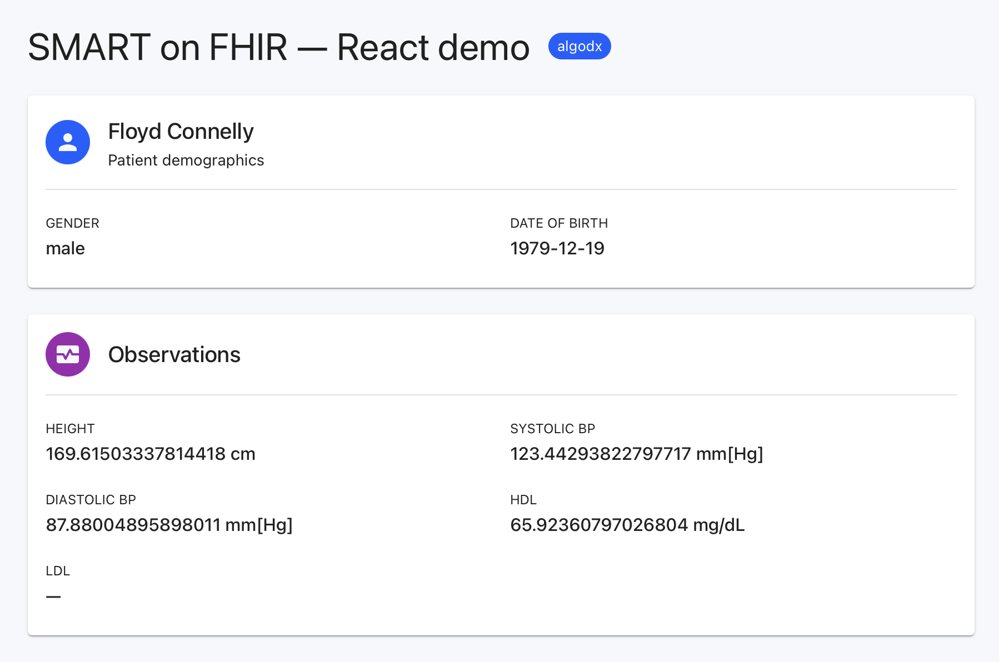

# smart-on-fihr-tutorial



A minimal SMART on FHIR provider-launch app that reads a patient's demographics and a handful of observations (height, BP panel, HDL/LDL) from any FHIR server and renders them in the browser. Originally the [cerner/smart-on-fhir-tutorial](https://github.com/cerner/smart-on-fhir-tutorial) static demo; this fork adds two things worth caring about.

**What's here:**

- **`/example-smart-app/`** — the original tutorial, patched for DSTU2/R4 name-shape differences and wired with Sentry (errors, tracing, replay, structured logs).
- **`/react-app/`** — a full rebuild on Vite + React 19 + TypeScript + MUI + `fhirclient` v2 + `@sentry/react`, intended as the starting point for real integration work.

**Why the rebuild:** the upstream tutorial uses jQuery 1.12.4, a precompiled `fhir-client-v0.1.12.js`, IE11 polyfills, and `.html()` sinks — fine for a learning demo, not fine as a foundation for production. The React variant keeps the same SMART launch flow but replaces all of that with a modern, typed, observable stack.

> Note: the repo name contains a typo (`fihr`, not `fhir`). URLs below use the actual repo name.

## Launching via SMART Health IT (no registration)

This fork ships **two variants** of the same SMART app:

- `/example-smart-app/` — original tutorial, patched (null-safe, Sentry-instrumented)
- `/react-app/` — modern rebuild: Vite + React + TypeScript + MUI + `fhirclient` v2 + `@sentry/react`

Steps (same for both):

1. https://launch.smarthealthit.org
2. **Launch Type**: Provider EHR Launch (default)
3. **FHIR Version**: R4 *(both variants tolerate R2 or R4 after the null-safe fix)*
4. Pick any **Patient** and **Provider** — not blank, this matters
5. **App Launch URL** — pick one:
   - React: `https://lekman.github.io/smart-on-fihr-tutorial/react-app/launch.html`
   - Static: `https://lekman.github.io/smart-on-fihr-tutorial/example-smart-app/launch-smart-sandbox.html`
6. **Launch App**

### Launching via Cerner (requires registration)

See the tutorial at https://lekman.github.io/smart-on-fihr-tutorial/ for the full registration walkthrough. After registering, paste the Cerner `client_id` into `example-smart-app/launch.html:29` (and `example-smart-app/launch-patient.html:29` for the patient flow). The React app uses a placeholder `client_id` that the SMART Health IT launcher accepts without validation; for Cerner, edit [`react-app/src/launch.tsx`](react-app/src/launch.tsx).

## Setup

### 1. GitHub Pages

Pages is configured to publish from the `gh-pages` branch. If deploys stop firing, check https://github.com/lekman/smart-on-fihr-tutorial/settings/pages and make sure **Source** is either:

- **Deploy from a branch** → `gh-pages` / `/ (root)` — legacy auto-builder, no workflow file needed (matches upstream tutorial), or
- **GitHub Actions** — requires [`.github/workflows/pages.yml`](.github/workflows/pages.yml) to exist.

### 2. Sentry DSN

Paste your Sentry project DSN into [`example-smart-app/src/js/sentry-init.js`](example-smart-app/src/js/sentry-init.js):

```js
var DSN = "https://<public-key>@<org>.ingest.<region>.sentry.io/<project-id>";
```

Find it at https://sentry.io/settings/projects/<client>/keys/. DSNs are public and safe to commit.

Commit + push to `gh-pages`. GitHub Pages redeploys in 1–2 minutes.

## Test pages

All URLs live under `https://lekman.github.io/smart-on-fihr-tutorial/example-smart-app/`.

| Page                         | URL suffix                                  | Purpose                                                          |
| ---------------------------- | ------------------------------------------- | ---------------------------------------------------------------- |
| Health check                 | `health.html`                               | Verifies Pages deploy is live                                    |
| EHR launch (Cerner)          | `launch.html`                               | Entry for Cerner sandbox; needs Cerner `client_id`               |
| EHR launch (SMART Health IT) | `launch-smart-sandbox.html`                 | Entry for SMART Health IT launcher; no `client_id` validation    |
| Standalone patient launch    | `launch-patient.html?iss=<FHIR-server-URL>` | Patient-facing standalone flow; needs Cerner patient `client_id` |
| Redirect target              | `index.html`                                | Renders patient + observations after OAuth redirect              |

## Verifying Sentry

After launching, check the `<client>` project in Sentry:

- **Logs** — `Page loaded` (tagged `smart.page: launch-smart-sandbox` then `index`) and `Patient data assembled`
- **Traces** — page-load transactions per entry point
- **Replays** — 10% of all sessions, 100% of sessions with errors
- **Issues** — should be empty on the happy path; breakdowns include the SMART flow `stage` (e.g. `issuing-fhir-requests`, `unpacking-fhir-response`) and the patient ID

Force a test event from DevTools:

```js
Sentry.captureException(new Error("smoke test"));
```

## Changes

Changes relative to the upstream `cerner/smart-on-fhir-tutorial`:

### `example-smart-app/src/js/example-smart-app.js` — null-safe FHIR extraction

- `HumanName.family` is `string[]` in DSTU2 but `string` in STU3/R4. Original code called `.join()` unconditionally and crashed on newer servers. Replaced with `nameToString()` helper that accepts either.
- Added `safeGet()` for nested-property access across `patient.name`, `patient.birthDate`, `patient.gender`, and observation `valueQuantity` chains.
- Wrapped `patient.read()` and `fetchAll` in try/catch so FHIR issuance errors surface via Sentry rather than silent promise rejections.
- Emits Sentry breadcrumbs at each SMART flow stage (`extractData started`, `FHIR.oauth2.ready resolved`, `patient + observations resolved`) and structured logs via `Sentry.logger.info/warn`.

### `example-smart-app/src/js/sentry-init.js` — new

Shared Sentry bootstrap. Reads DSN constant, initialises browser tracing, session replay, and logs. Tags every event with a `smart.page` value (`launch` / `launch-smart-sandbox` / `launch-patient` / `index` / `health`) derived from the URL, so you can filter by flow stage in Sentry.

### `example-smart-app/*.html` — Sentry script tags

Added the Sentry Browser SDK CDN bundle (`bundle.tracing.replay.feedback.logs.metrics.min.js`, SRI-pinned) and `sentry-init.js` to the `<head>` of `index.html`, `launch.html`, `launch-smart-sandbox.html`, and `launch-patient.html`. Must load before app code so `Sentry.logger.*` is available when `extractData` runs.

### `.github/workflows/pages.yml` — new (optional)

Deploy workflow for the case where Pages source is set to **GitHub Actions** rather than **Deploy from a branch**. If you leave Pages on the legacy branch-deploy mode (the tutorial's default), this workflow is unused and can be deleted.

## Lessons Learned

### Pick a patient and a provider in the SMART launcher

In https://launch.smarthealthit.org, leaving **Patient** and **Provider** empty makes the launcher skip setting the launch context. The app then has no patient to read, `smart.patient` is missing or incomplete, and `extractData` fails in ways that look like code bugs. Always pick both from the dropdowns before clicking _Launch App!_.

### Match the FHIR version to the code

The upstream tutorial was written for **FHIR DSTU2 (R2)**. Selecting **R4** in the launcher returns resources with a different shape for common fields:

- `HumanName.family` is `string[]` in DSTU2 but `string` in STU3/R4 — this is what caused the original `patient.name[0].family.join is not a function` crash.
- Other fields (addresses, telecoms, references) have similar cardinality changes between versions.

Either run the launcher on **R2 (DSTU2)** to match the tutorial, or keep R4 and rely on the null-safe helpers added in [`example-smart-app.js`](example-smart-app/src/js/example-smart-app.js) (`nameToString`, `safeGet`) to handle both shapes. The fixed code tolerates either version, but the mismatch is a good reminder that _FHIR version is part of your API contract_ — treat it like a breaking change.

### Observability catches the boring errors fastest

The original code logged `'Loading error'` to the console and rejected silently. That made the R4 shape mismatch look like "the app is broken" rather than "this specific field has a different type on this server". Sentry with breadcrumbs + `captureException` + a `stage` context field turned a 20-minute guessing session into a glance at the stack trace. Worth the 20-minute setup cost on day one of any new app.

## Production Integration — Context and Open Questions

This tutorial fork is the starting point for an <client> integration targeting a **May 2026 release**. FHIR **R4** is confirmed working against the SMART Health IT sandbox after the null-safe fixes above.

### Design system: Terra is archived, successor unclear

- **Terra UI** (terra-core, terra-framework, terra-clinical) was Cerner's official React component library and the recommended path for SMART apps embedded in MPages. Using it let apps pass Oracle Health's UI/UX validation and look native inside PowerChart.
- The Cerner GitHub org was **archived on 2026-01-06**. Terra's npm packages still resolve, but there are no further updates, security patches, or Oracle Health endorsement.
- Oracle Health has not yet published a successor design system or updated guidance.

### How the SMART app actually renders

The app launches in an iframe inside the MPage (or a full new window, depending on config). It's our HTML/CSS/JS running inside Cerner's shell — Oracle Health used to validate for consistency with their Design Standard Guidelines, Terra was the recommended path to pass.

### Open questions before we commit to a UI stack

1. Does **MHN's** Oracle Health instance have any UI requirements for embedded SMART apps?
2. Does **<client>** have an existing design system or component library from previous deployments (the PoC at the two Chicago hospitals)?
3. Is **Oracle Health** still enforcing design validation for SMART apps, and if so, against what standard now that Terra is archived?

### Interim direction

If there are no constraints from MHN or Oracle Health, a clinical-grade React component library like [shadcn/ui](https://ui.shadcn.com/) or [Radix UI](https://www.radix-ui.com/) with a neutral, high-contrast theme gives a professional baseline without betting on a deprecated stack. Decide only after the three questions above are answered — rebuilding UI later is more expensive than the two-week delay to confirm.

### Sources

- https://engineering.cerner.com/terra-ui/
- https://github.com/cerner/terra-core
- https://github.com/cerner/terra-clinical
- https://docs.oracle.com/en/industries/health/millennium-platform-apis/smart-developer-overview/
- https://groups.google.com/g/cerner-fhir-developers/c/nOQzGIaB0Ac
- https://code.cerner.com/
